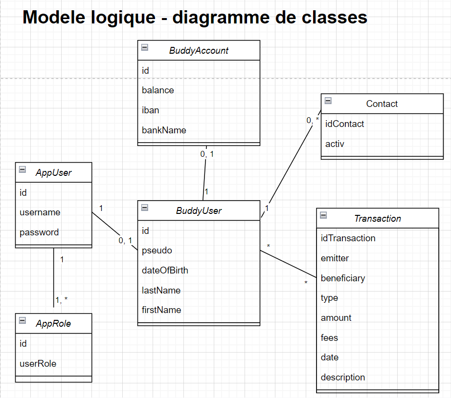
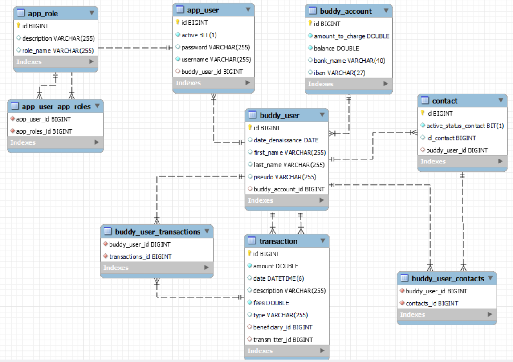
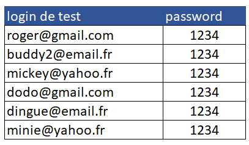

  

## Presentation of Pay my Buddy :

### What are the objectives of this application ?
 
This application allows users to easily make transfers to their buddies : 
	- No lag in transfer time, 
	- no complex bank details of the beneficiary to register !

### In the facts : how does it work ?

User can register, and login with his email address.
Once connected, a user has to fill in his personal and bank details. 
He also need to fund his buddy account.
Aflter that, he can add to his list of buddies another user of the application in looking for his email.
Then, the user can make a transfer of money to this buddy.
Each user can consult his list of buddies and his list of transfers already made.

## To be more pratical

### Getting Started

#### Spring Boot Project with  
 - Java 17
 - Thymeleaf
 - Spring Security
 - Spring Data JPA
 - Spring Web

# Diagramme de classe #

# Modèle physique de données

### Running App

Post installation of MySQL, Java and Maven, you will have to set up the tables and data in the data base.
For this, please run the sql commands present in the `data.sql` file under the `resources\static` folder in the code base.

Finally, you will be ready to import the code into an IDE of your choice and run the PaymybuddyApplication.java to launch the application.
After compil, you can gon on : [http://localhost:8092](http://localhost:8092)  to play with the App !

Here you are some login and password to test it :

### Testing

The app has unit tests and integration tests written. 
To run the tests from maven, go to the folder that contains the pom.xml file and execute the below command.

`mvn test`

